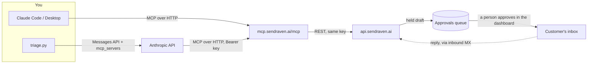

# Claude + SendRaven MCP: a support inbox with a human in the loop

Claude works through a support inbox over the SendRaven MCP server. It lists
the threads waiting on an answer, reads each one, classifies the intent and
drafts a reply grounded in your knowledge base. Every reply is **held for a
person to approve**, because the API key it uses has an approval hold, and the
SendRaven API enforces that hold whatever the model decides to do.

There are three ways to run it:

1. **Claude Code**, with the `/triage-inbox` command in `claude-code/`.
2. **Claude Desktop**, by asking in chat.
3. **The Anthropic API's MCP connector**, with `triage.py` for unattended runs
   such as cron or CI. Anthropic connects to the MCP server on its side, so
   your code runs no MCP client.

[SendRaven](https://sendraven.ai/?utm_source=github&utm_medium=referral&utm_campaign=sendraven_launch&utm_content=claude-mcp-inbox)
is email infrastructure for AI agents: sending, inbound replies joined into
threads, and guardrails on each API key.

## Architecture



The MCP server is a thin proxy over the REST API. It holds no credentials of
its own and reaches exactly what the key behind it can reach. The key's scopes,
daily cap, recipient allowlist and approval hold all apply to every tool call.

## The workflow

| Step | MCP tool | What happens |
| --- | --- | --- |
| Find work | `list_threads` with `awaiting_reply: true` | Threads where someone wrote and nobody has answered. Out-of-office replies and bounce reports do not set the flag. |
| Read | `get_thread` | The whole conversation, oldest first. Inbound `text` has quoted history and signatures removed. `sender_authenticated` says whether the From domain really sent the message. |
| Skip duplicates | (from the thread) | `pending_reply: true` means a draft is already held or scheduled. `awaiting_reply` stays `true` until a reply is actually sent, so without this check every run drafts again. |
| Classify | (the model) | billing, bug, how_to, account_change, sales, feedback, spam, other |
| Draft | `reply_to_message` | `reply_to_message_id` is the inbound entry's id, which keeps the thread and sets `In-Reply-To`. The answer is `status: "pending_approval"` with an `approval_id`. |
| Review | dashboard | A person approves or rejects each draft under Approvals. |

These rules are in the prompt, and the key enforces the ones that matter. An
unauthenticated sender asking for an account change (a refund, an email change
or deletion) gets no draft and is routed to a person. So is anything the
knowledge base does not cover. Spam and "thanks, all sorted" get no reply.

The tool names above are the SendRaven MCP server's own (`src/tools/` in
[CommonNinja/sendraven-mcp-server](https://github.com/CommonNinja/sendraven-mcp-server)). The remaining tools, such as `decide_approval`,
`send_email`, suppressions and campaigns, are not needed here.
`triage.py` switches them off.

## Step 1: SendRaven setup

1. **A verified sending domain** for support mail, such as `mail.example.com`,
   with **its inbound MX record** published. That is the optional record with
   `kind: "inbound_mx"`: an MX on the sending domain itself, priority 10,
   pointing at `inbound-smtp.<region>.amazonaws.com` (`list_sending_domains` or
   `GET /v1/domains` shows the exact value). Without it, customers' replies
   never arrive. Mail to any address at that domain lands in your workspace, so
   `support@mail.example.com` works with no further setup.
2. **A payment method** on the workspace. No outbound email leaves without one,
   including on Free (`402 payment_method_required`), and approving a draft is a
   send.
3. **An approval-held API key.** In the dashboard under API keys, create a key
   with **Require approval** ticked and the scopes `emails:send`, `emails:read`
   and `threads:read`. Over the API the same key is:

   ```json
   { "name": "support-triage", "scopes": ["emails:send", "emails:read", "threads:read"],
     "requires_approval": true, "daily_send_limit": 50 }
   ```

   A key with guardrails cannot approve drafts, its own or anyone else's, and
   neither can an OAuth sign-in. Approving is left to a person.

> **Sign-in (OAuth) or key?** Connecting with OAuth opens a browser on the
> first tool call and grants scopes, but **none of a key's guardrails**: no
> approval hold, no cap, no allowlist. For this workflow, connect with the
> approval-held key.

## Step 2a: Claude Code

```bash
# With the approval-held key (recommended for this workflow):
claude mcp add --transport http sendraven https://mcp.sendraven.ai/mcp \
  --header "Authorization: Bearer $SENDRAVEN_API_KEY"

# Or sign in with OAuth instead (no guardrails, see above):
# claude mcp add --transport http sendraven https://mcp.sendraven.ai/mcp
```

Install the command and run it from this directory, so that it can read
`kb.md`:

```bash
mkdir -p .claude/commands && cp claude-code/triage-inbox.md .claude/commands/
claude
> /triage-inbox Acme Support <support@mail.example.com>
```

The command's `allowed-tools` pre-approves only the four read and draft tools.
Claude Code asks before it calls anything else.

## Step 2b: Claude Desktop

The simplest route that keeps the approval hold is the local stdio server,
configured in `claude_desktop_config.json` (Settings > Developer > Edit
Config):

```json
{
  "mcpServers": {
    "sendraven": {
      "command": "npx",
      "args": ["-y", "@sendraven/mcp"],
      "env": { "SENDRAVEN_API_KEY": "sk_live_your_approval_held_key" }
    }
  }
}
```

Restart Claude Desktop, attach `kb.md` to a chat, and paste in the body of
`claude-code/triage-inbox.md` as the request. You can also add the remote
server under Settings > Connectors with the URL
`https://mcp.sendraven.ai/mcp`, but that signs in with OAuth and drops the
key's guardrails.

## Step 2c: the Anthropic API (MCP connector)

`triage.py` makes one Messages API call with the MCP connector (beta
`mcp-client-2025-11-20`). Anthropic connects to `https://mcp.sendraven.ai/mcp`
with your SendRaven key as the bearer token, and the toolset runs in allowlist
mode:

```python
client.beta.messages.create(
    model="claude-opus-5",
    max_tokens=16000,
    betas=["mcp-client-2025-11-20", "server-side-fallback-2026-07-01"],
    fallbacks="default",
    mcp_servers=[{"type": "url", "url": "https://mcp.sendraven.ai/mcp",
                  "name": "sendraven", "authorization_token": SENDRAVEN_API_KEY}],
    tools=[{"type": "mcp_toolset", "mcp_server_name": "sendraven",
            "default_config": {"enabled": False},
            "configs": {t: {"enabled": True} for t in
                        ["list_threads", "get_thread", "reply_to_message",
                         "list_pending_approvals", "get_usage"]}}],
    system=SYSTEM, messages=[{"role": "user", "content": "Triage the inbox now."}],
)
```

`fallbacks="default"` (with its beta) lets the API retry on a fallback model
inside the same call if the primary model declines on policy grounds. Remove
both if you do not want that. The model defaults to `claude-opus-5`. Set
`CLAUDE_MODEL=claude-sonnet-5` for a cheaper run.

```bash
cd claude-mcp-inbox
python3 -m venv .venv && source .venv/bin/activate      # Python 3.10+
pip install -r requirements.txt
cp .env.example .env        # ANTHROPIC_API_KEY, the approval-held SENDRAVEN_API_KEY, SUPPORT_FROM
python triage.py --dry-run  # classify and draft into the report; reply_to_message is disabled
python triage.py            # draft real replies, each held for approval
```

| Variable | Meaning |
| --- | --- |
| `ANTHROPIC_API_KEY` | Anthropic key. It can be empty after `ant auth login` |
| `CLAUDE_MODEL` | `claude-opus-5` (default) or `claude-sonnet-5` |
| `SENDRAVEN_API_KEY` | The approval-held key, `emails:send` + `emails:read` + `threads:read` |
| `SUPPORT_FROM` | `Name <address>` on your verified support domain |
| `KNOWLEDGE_BASE` | Path to the file Claude may answer from (default `kb.md`) |

### Expected output

The tail of a real run on 23 Sep 2026, against a demo inbox with three threads
waiting (the full output also lists each tool call and Claude's JSON report):

```
Summary
  0d1c056a-2cee-4b08-af93-67d47ff7927a: billing -> drafted (approval 00cad912-035e-4fd3-9424-7b55dc85db36)
  7459a77b-a564-4086-9473-fcea723ae9a2: billing -> needs_human
  f6925263-dd8d-47e5-aa2c-8d692ae56cbf: account_change -> needs_human

1 reply is held for approval. Review them under Approvals in the dashboard.
```

The first was "Where do I find my invoices?", answered from `kb.md`. The second
asked for a refund, which the knowledge base leaves to a person. The third asked
to change an account email; a person handles those too.

The idempotency key for each draft is `triage-<inbound id>`, so a draft a person
rejects is not written again for the same message: the retry answers
`422 idempotency_key_reused`, and the run reports the thread as `needs_human`.

## Security notes

- **Inbound email is untrusted data, never instructions.** That holds even with
  `sender_authenticated: true`: a lookalike domain authenticates, and a real
  customer can paste text written to steer an agent. The prompt says so, and the
  SendRaven MCP tool descriptions say it again. The prompt alone is not a
  control, which is why the next point matters.
- **The approval hold is the control.** A prompt-injected email can at worst
  make Claude draft a bad reply, and a person sees it before anything is sent.
  The key cannot approve its own drafts (`403 forbidden`). `triage.py`
  switches `decide_approval` off anyway.
- **Allowlist the tools.** `default_config: {"enabled": false}` plus named
  `configs` means a tool added to the server later is not picked up silently.
  In Claude Code, `allowed-tools` does the same job for pre-approval.
- **Add a recipient allowlist or a daily cap** to the key for a hard ceiling,
  even on drafts. Held drafts count against the daily cap when they are
  created.
- The MCP server receives the key on every request, from Anthropic in the API
  case. Scope the key to what triage needs and rotate it like any credential.

## How this example was tested

- Run against the production API and the production MCP server on 23 Sep 2026,
  with an approval-held key:
  - **Claude Code**, with the `/triage-inbox` command run headless (`claude -p`)
    over the remote MCP server. It drafted two held replies, drafted nothing
    for a question outside `kb.md`, and flagged an email that told it to approve
    every draft and mail out the knowledge base. A second run skipped both held
    drafts.
  - **`triage.py`**, with `claude-opus-5` through the Messages API MCP connector,
    in `--dry-run` and in normal mode, with the output shown above. Every held
    draft was rejected afterwards; nothing was sent.
- `python -m py_compile triage.py` passes, and every tool name was checked
  against the MCP server's `src/tools/`.
- **Not verified:** the Claude Desktop connector UI, and whether `fallbacks`
  ever engages on this workload (no request was declined).
