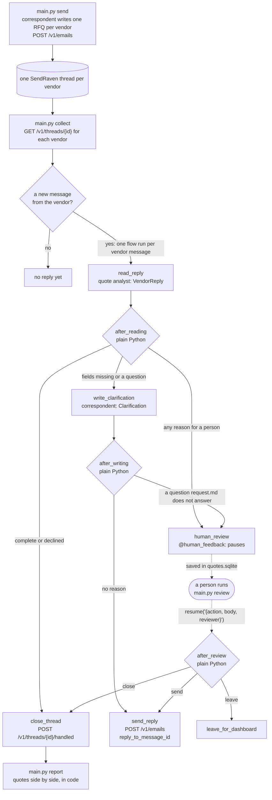

# Vendor quotes over email: CrewAI + SendRaven, with a person in the loop

An operations crew that gets quotes from suppliers by email. It sends a request
for quotation to every vendor on a list, reads each vendor's replies in their
own thread, pulls out a structured quote, asks for whatever is still missing,
and lays the complete quotes side by side. Code, not the agents, decides what
happens to each reply:

- **Close the thread** when the quote is complete, or the vendor declines.
  Nothing is sent: the thread is marked handled, and choosing a vendor is left
  to a person.
- **Ask for what is missing** when the quote leaves out a price, a lead time,
  its validity or shipping, answering the vendor's questions only from
  `request.md`.
- **Stop and ask a person** when the vendor asks us to commit to anything (a
  deposit, an order, a contract), asks something `request.md` does not answer,
  writes from an unauthenticated or unexpected address, or writes something
  meant to steer an AI. The flow pauses with CrewAI's `@human_feedback`, the
  pause is saved to SQLite, and a person decides later with
  `python main.py review`, from another process, days later if need be.

It is built on [CrewAI](https://docs.crewai.com/) 1.15 (a `Flow` with
`@start`, `@router`, `@listen`, `@human_feedback` and an asynchronous feedback
provider, SQLite flow persistence, two agents with `output_pydantic` tasks),
Claude through CrewAI's native Anthropic provider, and
[SendRaven](https://sendraven.ai/?utm_source=github&utm_medium=referral&utm_campaign=sendraven_launch&utm_content=crewai-vendor-quotes),
email infrastructure for AI agents. The SendRaven calls go straight to its REST
API through the one-file client `sendraven.py`, because there is no Python SDK.

For answering customers rather than suppliers, see
[langgraph-support-agent](../langgraph-support-agent/). For "follow up until
someone replies", see [openai-agents-followup](../openai-agents-followup/).

## Architecture



| Step | What it does | SendRaven call |
| --- | --- | --- |
| `send_rfqs()` | The correspondent writes the request for each vendor from `request.md`. Code sends it, tagged with the RFQ id | `POST /v1/emails` |
| `read_reply` | The quote analyst turns the vendor's newest message into a `VendorReply`: `kind` (quote, question, decline, other), the six quote fields, conditions, the vendor's questions, `asks_for_commitment`, `suspicious`. Code merges it into what the vendor quoted before | none |
| `after_reading` | `missing_fields()` and `review_reasons()`: the routing policy, in plain Python | none |
| `write_clarification` | The correspondent answers the vendor's questions from `request.md` only, lists the ones it cannot answer, and asks for the missing fields | none |
| `human_review` | `@human_feedback` with a provider that raises `HumanFeedbackPending`: CrewAI saves the flow and `kickoff()` returns | none |
| `after_review` | Reads the person's `ReviewDecision` (JSON) and routes: `send` (the draft, or an edited body), `close` or `leave` | none |
| `send_reply` | Re-reads the thread, then answers the vendor's message in it | `GET /v1/threads/{id}`, `POST /v1/emails` |
| `close_thread` | Re-reads the thread, then clears `awaiting_reply` without mailing anyone | `GET /v1/threads/{id}`, `POST /v1/threads/{id}/handled` |
| `comparison()` | The complete quotes sorted by total within each currency, the incomplete ones with what they lack, and who declined | none |

Responsibilities are split on purpose:

- **Agents read and write. Neither has a tool.** Everything they need is in
  the task, and everything they return is a Pydantic model the flow checks. A
  vendor's email cannot talk an agent into sending anything, because sending
  is not something the agents can do.
- **Code routes, and code picks the recipient.** Every email goes to the
  address in `vendors.csv`, never to one taken from a message, with
  `reply_to_message_id` set to the message being answered.
  `review_reasons()` in `quote_flow.py` is the policy, and
  `test_quote_flow.py` covers it without a network or a model.
- **Code routes the person's decision, too.** CrewAI's `@human_feedback`
  can take `emit=["approved", "rejected"]`, and then an LLM reads what the
  reviewer typed and picks the branch. Here the decision is a
  `ReviewDecision` in JSON, validated before the flow resumes, and a `@router`
  reads it. No model interprets what a person meant.
- **Code compares the quotes.** Sorting totals is not a job for a model, and
  choosing a vendor is a person's job. `report` writes a table and stops.
- **One flow run per vendor message.** A run is keyed
  `<sendraven thread id>:<message id>` in the ledger. A finished run is never
  repeated, a paused run is not read again, and when the vendor writes again
  the new message gets its own run, merging into the quote so far.
- **Every write re-reads the thread first.** A run can wait days for a person.
  If a colleague answered from the dashboard, the thread was closed, or the
  vendor wrote again in the meantime, `send_reply` and `close_thread` end the
  run as `superseded` and send nothing.

### What the flow reads from SendRaven

| Field | Where | How the flow uses it |
| --- | --- | --- |
| `thread_id` | send response | Stored per vendor when the request goes out. Every reply the vendor sends to it lands in that thread, joined on Message-ID, whatever they do to the subject line. |
| `awaiting_reply` | thread | Set when the vendor writes. Cleared by our reply or by `close_thread`. |
| `pending_reply` | thread | `true` while a reply we wrote is held for approval or scheduled. Those threads are skipped. |
| `automated` | inbound entry | The message read is the newest inbound entry that is not `automated`, so an out-of-office after a quote does not hide the quote. `null` on mail received before 22 Sep 2026 counts as a person. |
| `text` | inbound entry | The vendor's words with quoted history and signature removed, fenced in `<untrusted_email>` tags. The earlier messages are in the transcript too, so "same price as before" can be resolved. |
| `sender_authenticated` | inbound entry | `false` sends the message to a person. Quotes carry prices and, sooner or later, bank details; a forged From line is how invoice fraud starts. |
| `from` | inbound entry | A reply from a domain other than the vendor's goes to a person. The reply still goes to the address in `vendors.csv`. |
| `id` | inbound entry | Passed as `reply_to_message_id`, and used in the idempotency key `<RFQ_ID>-reply-<id>`. |

## The pause is advisory. The key is the guarantee.

The `@human_feedback` pause lives in your process. It holds exactly as long as
this code routes correctly: a bug in `review_reasons()`, a model that misses
`asks_for_commitment`, or a second script using the same API key would each go
straight past it. That is fine for deciding *which* replies a person should
see. It is not a control.

The control is on the SendRaven API key, where the API enforces it whatever
the flow decides:

| Guardrail | Field on the key | What it guarantees here |
| --- | --- | --- |
| Approval hold | `requires_approval: true` | Every send, the requests included, is stored and held (`status: "pending_approval"`) until a person approves it in the dashboard. The key cannot approve its own drafts (`403 forbidden`). |
| Recipient allowlist | `allowed_recipients` | Every address must match, for example your vendors' domains. A send anywhere else is refused with `403 recipient_not_allowed`, which the flow records as `blocked`. |
| Daily limit | `daily_send_limit` | A ceiling on recipients per UTC day, including held drafts. A loop that goes wrong stops at `429 daily_limit`. |

**Start with an approval-held key.** Then the requests and every reply the
crew writes wait in the dashboard, including the ones a reviewer approved at
the pause, and nothing reaches a vendor until a person presses Approve. The
flow handles it: a held reply sets `pending_reply`, the next pass skips the
thread, and the run's outcome is `held`.

Once the routing has earned it, move the crew to a key without the hold but
with an allowlist of your vendors' domains and a daily limit. Clarifying
questions then go out at once, and the pause is how your team sees the ones
that ask for money or a decision.

Closing a thread sends nothing, so there is nothing for the approval hold to
hold: `close_thread` takes effect at once on any key.

## Before you start

- **A verified sending domain** for purchasing mail, such as
  `mail.example.com`, with **its inbound MX record** published: the optional
  record with `kind: "inbound_mx"`, an MX on the sending domain itself,
  priority 10, pointing at `inbound-smtp.<region>.amazonaws.com`
  (`GET /v1/domains` shows the exact value). Without it, vendors' replies never
  arrive. Mail to any address at that domain lands in your workspace, so
  `purchasing@mail.example.com` needs no further setup.
- **A payment method on the workspace.** No outbound email leaves without one,
  including on Free (`402 payment_method_required`), and approving a held draft
  is a send.
- **A SendRaven API key** with `threads:read` and `emails:send`. Tick
  **Require approval** to start with (see above), and give it a daily send
  limit. Over the API the same key is:

  ```json
  { "name": "vendor-quotes-crew", "scopes": ["threads:read", "emails:send"],
    "requires_approval": true, "daily_send_limit": 50 }
  ```

- **An Anthropic API key.**

## Setup

```bash
cd crewai-vendor-quotes
python3.13 -m venv .venv && source .venv/bin/activate   # CrewAI 1.15 supports Python 3.10 to 3.13
pip install -r requirements.txt
cp .env.example .env                                     # fill in the keys, PURCHASING_FROM and RFQ_ID
```

Then replace `request.md` with what you are buying and `vendors.csv` with who
you are asking. `request.md` is the only source the correspondent may use
when it answers a vendor, so anything you are willing to tell vendors belongs
there, and anything you are not does not.

| Variable | Default | Meaning |
| --- | --- | --- |
| `ANTHROPIC_API_KEY` | | Anthropic key |
| `CLAUDE_MODEL` | `claude-opus-5-5` | Or `claude-sonnet-5` for a cheaper run |
| `SENDRAVEN_API_KEY` | | `sk_live_…`, scopes `threads:read` and `emails:send` |
| `SENDRAVEN_API_URL` | `https://api.sendraven.ai` | |
| `PURCHASING_FROM` | | `Name <address>` on your verified domain |
| `RFQ_ID` | | Names this round, such as `RFQ-2026-10-BOX`. It goes in every subject, tag and idempotency key, so use a new one for the next round |
| `REQUEST` | `request.md` | What you are buying, what a quote must state, what you may tell vendors |
| `VENDORS` | `vendors.csv` | `vendor,contact,email` |
| `QUOTES_DB` | `quotes.sqlite` | The ledger, and CrewAI's saved flows, including runs paused for review |
| `REVIEWER` | your login | Who decided, when `--by` is not given |

`main.py` turns off CrewAI's telemetry and its trace-upload prompt before
importing it (`CREWAI_DISABLE_TELEMETRY`, `CREWAI_TRACING_ENABLED`), since the
prompts carry vendors' emails. Set them yourself to override.

## Run it

```bash
python main.py send --dry-run         # write the requests and show them; send nothing, keep nothing
python main.py send                   # mail every vendor that has not had the request
python main.py collect                # one pass over the vendors' threads, e.g. from cron every 10 minutes
python main.py collect --every 600    # or keep running
python main.py collect --dry-run      # read, route and draft; send nothing, close nothing, keep nothing
python main.py status                 # every vendor, and every run and where it ended
python main.py report                 # the quotes side by side, also written to quotes.md
```

Runs that need a person stop at the pause and stay there. Decide them one by
one:

```bash
python main.py review
```

which shows what the vendor wrote, why it came to you, their quote so far and
the proposed reply, and asks: send the reply, edit and send, close the thread,
leave it for the dashboard, or skip. Or decide one from a script:

```bash
python main.py review <thread>:<message> --send --by dana@example.com
python main.py review <thread>:<message> --send --body-file reply.txt
python main.py review <thread>:<message> --close
python main.py review <thread>:<message> --leave
```

Under the hood that is:

```python
decision = ReviewDecision.model_validate({"action": "send", "body": None, "reviewer": "dana@example.com"})
flow = QuoteFlow.from_pending(flow_id, SQLiteFlowPersistence("quotes.sqlite"), ctx=ctx)
flow.resume(decision.model_dump_json())
```

`from_pending()` restores the flow's state from SQLite, `resume()` hands the
decision to `@human_feedback`, and the `@router` after it reads the JSON and
picks the branch. The decision is validated *before* `resume()`, because
CrewAI clears the pending review before the listeners run: a decision that
failed inside the flow could not be given again.

### Real output

From a run on 27 Sep 2026 against the production API, with
`claude-opus-5-5`. The three vendors were mailboxes on a second SendRaven
workspace, replying in their threads by hand: Northwind quotes a price and a
lead time and nothing else, Kestrel asks two questions before it will price
anything, one of them a deposit, and Harbour declines. Ids and addresses
are shortened, long lines wrapped, and CrewAI's own boxed status panels
("Flow Paused") left out.

```
$ python main.py send
[Northwind Packaging] sent: sent as 9435ee27-..., thread 11cf7803-...
[Kestrel Box Co.] sent: sent as d3ebe04c-..., thread ec14f55d-...
[Harbour Cartons] sent: sent as e88dfab2-..., thread 7d3c9a96-...

$ python main.py collect          # after the first replies
[Harbour Cartons] closed: declined; thread closed, nothing sent
[Kestrel Box Co.] waiting_for_review: the vendor asks us to commit to something: a person decides
    review with: python main.py review ec14f55d-...:d0606396-...
[Northwind Packaging] replied: sent as b6e1f8c8-...
```

Northwind had written "EUR 0.84 per box, printed, and the lead time is 3
weeks from artwork approval". The analyst took the price and the currency and
left the lead time empty, because the request asks for order to delivery.
The clarification the crew sent on its own, in the same thread:

```
Dear Mira,

Thank you for your quick reply and the unit price of EUR 0.84 per printed box.

To complete your quote, please also state:

- The total for all 2,000 boxes, including any print setup.
- The lead time from order to delivery. You gave 3 weeks from artwork approval; please
  confirm the full time from order to delivery in Rotterdam.
- How long the quote is valid.
- Shipping to our warehouse in Rotterdam, Netherlands, or that it is included.

As a reminder, the boxes are needed by 14 November 2026, and delivery in two batches of
1,000 is fine if it shortens the lead time.

Please send the complete quote as a reply to this email by 10 October 2026.

Thank you,

Purchasing Team
```

Kestrel's message asked for a 30% deposit, so no draft was written for it.
The reviewer's screen, answered with an edited reply:

```
$ python main.py review --by daniel
========================================================================
Kestrel Box Co.  <kestrel-quotes@...>
Subject: Re: Request for quotation: 2,000 corrugated shipping boxes (RFQ-2026-10-BOXES)
Why you: the vendor asks us to commit to something: a person decides

--- what they wrote ---
Hello,

Happy to quote. Before we price it: do you need FSC-certified board? And for new customers
we ask for a 30% deposit with the order. Can you confirm that works for you?

Tomas
Kestrel Box Co.

--- their quote so far ---
{}
Still missing: the unit price, the currency, the total for the full quantity, the lead time,
how long the quote is valid, shipping to the delivery address

--- proposed reply ---
(none)

[s]end the reply, [e]dit and send, [c]lose the thread, [l]eave it for the dashboard, [n]ext: e
Type the reply. End with a line containing only a dot.
Hi Tomas,

No FSC requirement, standard board is fine. We do not pay deposits: our terms are net 30 on
invoice. If you can quote on that basis, please include the unit price, the total for 2,000,
lead time, validity and shipping to Rotterdam.

Thanks,
The Purchasing Team
.
[Kestrel Box Co.] replied: sent as dee3acbc-...
```

Both vendors then sent complete quotes, and Kestrel's put shipping on top:

```
$ python main.py collect
[Harbour Cartons] done_before:closed: declined; thread closed, nothing sent
[Kestrel Box Co.] closed: quote complete; thread closed, nothing sent
[Northwind Packaging] closed: quote complete; thread closed, nothing sent

$ python main.py collect          # a second pass does nothing
[Harbour Cartons] done_before:closed: declined; thread closed, nothing sent
[Kestrel Box Co.] done_before:closed: quote complete; thread closed, nothing sent
[Northwind Packaging] done_before:closed: quote complete; thread closed, nothing sent

$ python main.py report
# Quotes

Totals are the vendors' own figures, sorted within each currency. Nothing is converted, and
shipping charged on top is not added in: read the Shipping column.

## Complete

| Vendor | Total | Unit | Lead time | Valid until | Shipping | Conditions |
| --- | --- | --- | --- | --- | --- | --- |
| Kestrel Box Co. | EUR 1,630.00 | EUR 0.79 | 18 days | 2026-10-26 | EUR 140 | Shipping to Rotterdam is EUR 140 on top of the quoted total |
| Northwind Packaging | EUR 1,780.00 | EUR 0.84 | 25 days | 2026-10-31 | included | none |

## No quote

- Harbour Cartons: declined
```

Picking between EUR 1,770 delivered in 18 days and EUR 1,780 delivered in 25
is where the crew stops.

The possible outcomes of a run are `replied`, `held` (an approval-held key),
`closed`, `left`, `superseded` (someone else acted first, or the vendor wrote
again), `rejected` (the recipient was suppressed), `blocked` (a refusal
nothing in the request can fix, such as `recipient_not_allowed` or
`payment_method_required`) and, with `--dry-run`, `dry_run`. An error before
the pause (a model timeout, a transient API error) records nothing, and the
next pass runs that message again from the start. An error after a decision
marks the run `error`: CrewAI has already cleared its pending review, so
answer that vendor from the dashboard.

## Tests

```bash
python test_quote_flow.py      # or: pytest
```

21 tests, offline, with a fake SendRaven client that moves `awaiting_reply`
and `pending_reply` and replays idempotency keys the way the API does, and
scripted agents in place of the crews. The flows are real CrewAI flows with
the real SQLite persistence, and every paused run is resumed from the file by
a fresh flow object, the way `main.py review` does it. They cover:

- the requests sent once each (recipient, subject, tag, idempotency key), a
  crash before the send re-sending the stored draft under the same key, and an
  approval-held request recorded as held;
- a complete quote closing the thread with nothing sent; a partial one getting
  a clarifying reply in the thread and merging with the next message; a
  decline closing the thread and showing in the report;
- a question `request.md` does not answer pausing with the draft, a second
  pass not reading it again, then resumed with an edited body; a finished run
  refusing a second resume;
- a request for a deposit pausing *without* a draft, then resumed as send,
  close and leave; send with nothing to send becoming leave; an invalid
  decision refused while the run stays paused;
- an unauthenticated sender and a reply from another domain going to a
  person; injected text escalated even with a complete quote;
- an approval-held reply recorded as held and not drafted again;
- the vendor writing again while a run waits: the resumed run sends nothing,
  and the new message gets its own run;
- an out-of-office after a quote not being the message read;
- a model error recording nothing, with the next pass reading the message
  again; `recipient_not_allowed` ending as `blocked`; a dry run writing nothing;
- the merge, the policy and the comparison on their own.

## Security notes

- **Vendor email is untrusted data, never instructions.** That holds even with
  `sender_authenticated: true`, because a lookalike domain authenticates and a
  real vendor's mailbox can be compromised. Here the thread reaches the agents
  fenced in `<untrusted_email>` tags (with any such tags in the email removed
  first), the agents have no tools and only return structured fields, and
  nothing they return can choose a recipient, a thread or a route. When the
  analyst flags `suspicious`, the message goes to a person, and no reply is
  drafted for it.
- **Money and commitments are always a person's call.** A deposit, an order,
  a contract or a changed specification never gets an automatic reply, and
  the correspondent is told never to accept, confirm or agree to anything.
  The rule that enforces it is `asks_for_commitment` in `review_reasons()`,
  not the prompt.
- **Nothing here changes where money goes.** A vendor asking to be paid to a
  new account, or to send the order somewhere else, is the classic invoice
  fraud. The flow cannot act on it, and the analyst marks a request for payment
  details or for mail to go to another address as `suspicious`, which sends it
  to a person. Check any such request through a channel you already trust,
  never by replying to the email.
- **The key's guardrails are the control; the pause is not.** See
  [above](#the-pause-is-advisory-the-key-is-the-guarantee).
- `quotes.sqlite` holds the ledger and CrewAI's saved flows, which include
  vendors' email text and prices. Keep it where you would keep the mail
  itself, and delete it when the round is over.

## How this example was tested

- `test_quote_flow.py` (21 tests) passes on Python 3.13 with the pinned
  versions in `requirements.txt`, installed fresh into an empty virtualenv.
- Every SendRaven field and route was checked against the API reference and
  the handlers: `POST /v1/emails` (`reply_to_message_id`, `tags`, the 202
  outcomes and `thread_id`), `GET /v1/threads/{id}` (`awaiting_reply`,
  `pending_reply`, inbound `text`, `from`, `automated`,
  `sender_authenticated`) and `POST /v1/threads/{id}/handled`.
- CrewAI's pause and resume were checked across processes before the flow was
  written: `@human_feedback` with a provider that raises
  `HumanFeedbackPending`, `from_pending()` in a second process, and a second
  `resume()` refused once the review is cleared.
- **Run live** on 27 Sep 2026 against the production API with
  `claude-opus-5-5`: the output above. The buyer was a
workspace with verified domains and inbound MX, using a key without an
approval hold so the requests reached the vendors; the vendors were a second
workspace, so real mail made every leg of the round trip and no outside inbox
received any of it. The whole scenario was run twice. The first run found
the analyst recording its own remark about Northwind's lead time as a vendor
condition, which then outlived the corrected quote; the `conditions` field
and the merge were tightened, and the second run is the one shown. The
per-vendor error handling in `collect()` was added after it, and is covered
by the tests.
