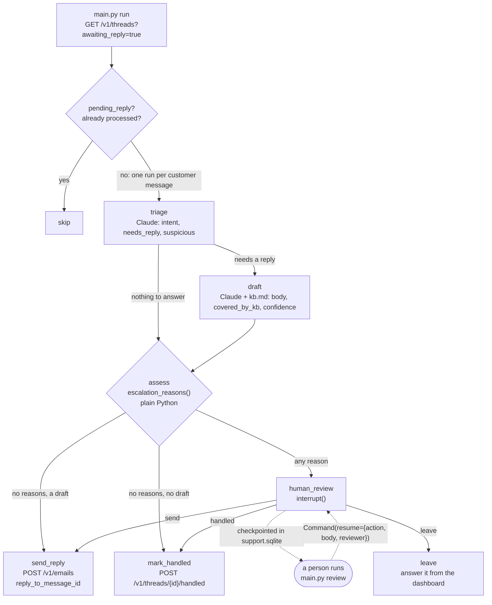

# Support agent over email: LangGraph + SendRaven, with a person in the loop

A support agent that works through the emails customers send you. For every
thread waiting on an answer it reads the customer's newest message, classifies
it, and drafts a reply grounded in `kb.md`. Then code, not the model, picks one
of three routes:

- **Answer in the thread** when the question is routine, the sender is
  authenticated and the knowledge base covers it.
- **Mark the thread handled** when there is nothing to answer ("thanks, all
  sorted"), so no courtesy mail goes out just to clear a flag.
- **Stop and ask a person** for refunds, account changes, unauthenticated
  senders, questions the knowledge base does not cover, low confidence, and
  email written to steer an AI. The graph pauses at a LangGraph `interrupt()`,
  the pause is checkpointed to SQLite, and a person decides later with
  `python main.py review`, from another process, hours later if need be.

It is built on [LangGraph](https://langchain-ai.github.io/langgraph/) 1.2
(`StateGraph`, `interrupt()`, `Command(resume=...)`, a SQLite checkpointer and
run-scoped `context`), Claude through `langchain-anthropic`, and
[SendRaven](https://sendraven.ai/?utm_source=github&utm_medium=referral&utm_campaign=sendraven_launch&utm_content=langgraph-support-agent),
email infrastructure for AI agents. The SendRaven calls go straight to its REST
API through the one-file client `sendraven.py`, because there is no Python SDK.

For "follow up until someone replies", see
[openai-agents-followup](../openai-agents-followup/). For the same triage over
the MCP server with no code of your own, see
[claude-mcp-inbox](../claude-mcp-inbox/).

## Architecture



| Node | What it does | SendRaven call |
| --- | --- | --- |
| `triage` | Classifies the customer's newest message: `billing`, `how_to`, `bug`, `refund`, `account_change`, `sales`, `feedback`, `spam` or `other`, plus `needs_reply` and `suspicious` | none |
| `draft` | Writes a reply from `kb.md` only, and says whether the knowledge base covered it and how confident it is | none |
| `assess` | `escalation_reasons()`: the routing policy, in plain Python | none |
| `human_review` | `interrupt()` with the customer's text, the reasons and the draft. Resumes with a `ReviewDecision`: `send` (optionally with an edited body), `handled` or `leave` | none |
| `send_reply` | Re-reads the thread, then answers the customer's message in it | `GET /v1/threads/{id}`, `POST /v1/emails` |
| `mark_handled` | Re-reads the thread, then clears `awaiting_reply` without mailing anyone | `GET /v1/threads/{id}`, `POST /v1/threads/{id}/handled` |

Responsibilities are split on purpose:

- **The model classifies and writes.** It never picks a recipient, a thread, or
  the route. The reply always goes to the sender of the message being answered,
  with `reply_to_message_id` set to that message's id, whatever the email says.
- **Code routes.** `escalation_reasons()` in `support_graph.py` is the policy,
  and `test_support_graph.py` covers it without a network or a model. Change
  what goes to a person there, not in a prompt.
- **One graph run per customer message.** The LangGraph thread id is
  `<sendraven thread id>:<inbound message id>`. A finished run is never
  repeated, a paused run is not drafted again, and when the customer writes
  again on the same thread the new message gets its own run.
- **Every write re-reads the thread first.** A run can wait hours at the
  interrupt. If a colleague answered from the dashboard, the thread was marked
  handled, or the customer wrote again in the meantime, `send_reply` and
  `mark_handled` end the run as `superseded` and send nothing.

### What the graph reads from SendRaven

| Field | Where | How the graph uses it |
| --- | --- | --- |
| `awaiting_reply` | thread | The poll lists `awaiting_reply=true`. A person's message sets it; out-of-office replies and bounce reports do not. |
| `pending_reply` | thread | `true` while a reply is held for approval or scheduled. Those threads are skipped, because `awaiting_reply` stays `true` until the held reply is actually sent. |
| `automated` | inbound entry | The message answered is the newest inbound entry that is not `automated`, so an out-of-office that lands after the customer's question is not the one answered. `null` on mail received before 22 Sep 2026 counts as a person. |
| `text` | inbound entry | The customer's words with quoted history and signature removed. This is what the model reads, fenced in `<untrusted_email>` tags. |
| `sender_authenticated` | inbound entry | `false` sends any reply to a person. A forged From line does not show up as an SPF `FAIL`, so the graph never looks at the raw verdicts. |
| `id` | inbound entry | Passed as `reply_to_message_id`, which sets `In-Reply-To` and `References` so the reply joins the conversation, and used in the idempotency key `support-<id>`. |

## The interrupt is advisory. The key is the guarantee.

The `interrupt()` lives in your process. It holds exactly as long as this
code routes correctly: a bug in `escalation_reasons()`, a threshold someone
lowered, a model that talks itself into high confidence, or a second script
using the same API key would each go straight past it. That is fine for
deciding *which* messages a person should look at. It is not a control.

The control is on the SendRaven API key, where the API enforces it whatever
the graph decides:

| Guardrail | Field on the key | What it guarantees here |
| --- | --- | --- |
| Approval hold | `requires_approval: true` | Every send is stored and held (`status: "pending_approval"`, an `approval_id`) until a person approves it in the dashboard. The key cannot approve its own drafts (`403 forbidden`). |
| Daily limit | `daily_send_limit` | A ceiling on recipients per UTC day, including held drafts. A loop that goes wrong stops at `429 daily_limit`. |
| Recipient allowlist | `allowed_recipients` | Every address must match. Useful while you test against your own addresses. |

**Start with an approval-held key.** Then every reply the graph sends is
held in the dashboard, including the ones a reviewer approved at the
interrupt, and nothing reaches a customer without a person pressing Approve.
That is deliberate double review while you build trust in the routing. The
graph handles it: a held reply sets `pending_reply`, the next pass skips the
thread, and the run's outcome is `held` with the approval id.

Once the routing has earned it, move the agent to a key without the hold but
with a `daily_send_limit`. Routine answers then go out at once, and the
interrupt is how your team sees the hard ones.

Marking a thread handled sends nothing, so there is nothing for the approval
hold to hold: `mark_handled` takes effect at once on any key. If you want a
person to see those cases too, send them to review (return a reason from
`escalation_reasons()` when there is no draft).

## Before you start

- **A verified sending domain** for support mail, such as `mail.example.com`,
  with **its inbound MX record** published: the optional record with
  `kind: "inbound_mx"`, an MX on the sending domain itself, priority 10,
  pointing at `inbound-smtp.<region>.amazonaws.com` (`GET /v1/domains` shows
  the exact value). Without it, customers' email never arrives. Mail to any
  address at that domain lands in your workspace, so
  `support@mail.example.com` needs no further setup.
- **A payment method on the workspace.** No outbound email leaves without one,
  including on Free (`402 payment_method_required`), and approving a held draft
  is a send.
- **A SendRaven API key** with `threads:read` and `emails:send`. Tick
  **Require approval** to start with (see above), and give it a daily send
  limit. Over the API the same key is:

  ```json
  { "name": "support-langgraph", "scopes": ["threads:read", "emails:send"],
    "requires_approval": true, "daily_send_limit": 50 }
  ```

- **An Anthropic API key**, or `ant auth login` once.

## Setup

```bash
cd langgraph-support-agent
python3 -m venv .venv && source .venv/bin/activate     # Python 3.10+
pip install -r requirements.txt
cp .env.example .env                                   # fill in the keys and SUPPORT_FROM
```

| Variable | Default | Meaning |
| --- | --- | --- |
| `ANTHROPIC_API_KEY` | | Anthropic key. It can be empty after `ant auth login` |
| `CLAUDE_MODEL` | `claude-opus-5-5` | Or `claude-sonnet-5` for a cheaper run |
| `SENDRAVEN_API_KEY` | | `sk_live_…`, scopes `threads:read` and `emails:send` |
| `SENDRAVEN_API_URL` | `https://api.sendraven.ai` | |
| `SUPPORT_FROM` | | `Name <address>` on your verified support domain |
| `KNOWLEDGE_BASE` | `kb.md` | The only source the drafts may use |
| `MIN_CONFIDENCE` | `0.75` | Drafts below this go to a person |
| `CHECKPOINT_DB` | `support.sqlite` | LangGraph's checkpoints, including paused runs |
| `REVIEWER` | your login | Who decided, when `--by` is not given |

Structured output uses `method="json_schema"`, Claude's structured outputs,
because `claude-opus-5-5` does not accept the forced tool call that
`langchain-anthropic` uses by default.

## Run it

```bash
python main.py run --dry-run        # classify, draft and route; send nothing, mark nothing, keep nothing
python main.py run                  # one pass, e.g. from cron every 5 minutes
python main.py run --every 300      # or keep running
python main.py run --thread <id>    # only one thread
python main.py status               # every run and where it ended
```

Runs that need a person stop at the interrupt and stay there. Decide them one
by one:

```bash
python main.py review
```

which shows the customer's text, why it came to you and the proposed reply, and
asks: send the draft, edit and send, mark handled, leave it for the dashboard,
or skip. Or decide one from a script:

```bash
python main.py review <thread>:<message> --send --by dana@example.com
python main.py review <thread>:<message> --send --body-file reply.txt
python main.py review <thread>:<message> --handled
python main.py review <thread>:<message> --leave
```

Under the hood that is one call:

```python
graph.invoke(Command(resume={"action": "send", "body": None, "reviewer": "dana@example.com"}),
             {"configurable": {"thread_id": key}}, context=ctx)
```

The node that called `interrupt()` runs again from the top, and `interrupt()`
returns the decision, validated against the `ReviewDecision` model
(`response_schema=`). A value that is not a decision raises and leaves the run
paused.

### Real output

From a run on 25 Sep 2026 against the production API, with `claude-opus-5-5`
and an approval-held key. Three customer emails were in the inbox: "Where do I
find my invoices?", a refund request, and "Thanks, that worked, all sorted
now". Each thread was run with `--thread`, so the output is one line per run.

```
$ python main.py run --thread bc81a0f9-...   # the invoices question
[bc81a0f9-f5d0-47c3-9de4-170e72d11d55] held: held for approval f69dbc67-be4f-4a7b-a628-7558f4892120 (message 345035e1-c658-4339-b851-02d012788236)

$ python main.py run --thread 7eda4a07-...   # the refund
[7eda4a07-9269-416f-b599-a0395feb0b9d] waiting_for_review: refund: a person decides these; the knowledge base does not cover it
    review with: python main.py review 7eda4a07-9269-416f-b599-a0395feb0b9d:1072a72f-2d1d-463e-a523-f225dfb16c8c

$ python main.py run --thread d12e822a-...   # "all sorted"
[d12e822a-7cba-497d-903d-a75204347726] handled: no reply needed; marked handled

$ python main.py run --thread bc81a0f9-...   # a second pass
[bc81a0f9-f5d0-47c3-9de4-170e72d11d55] skipped: a reply is already held for approval or scheduled

$ python main.py review 7eda4a07-9269-416f-b599-a0395feb0b9d:1072a72f-2d1d-463e-a523-f225dfb16c8c --send --by daniel
[7eda4a07-9269-416f-b599-a0395feb0b9d] held: held for approval 6380be51-1cd8-49f5-8b17-4d76d24a2726 (message f679be89-39e7-4147-94cc-dcdad6b82e85)
```

The draft for the invoices question, from `--dry-run` on the same thread:

```
Hi Dana,

Thanks for reaching out! You can find all your invoices under Settings > Billing > Invoices. They're available as PDFs, so you can download last month's invoice there and pass it straight to your accountant. [...]

Best regards,
The Support Team
```

The refund draft the reviewer saw said a person reviews refund requests and
will follow up, and promised nothing.

The possible outcomes of a run are `replied`, `held` (an approval-held key),
`handled`, `left`, `superseded` (someone else acted first, or the customer
wrote again), `rejected` (every recipient was suppressed), `blocked` (a refusal
nothing in the request can fix, such as `recipient_not_allowed` or
`payment_method_required`) and, with `--dry-run`, `dry_run`. A transient error
leaves the run at the node that failed, and the next pass continues it from
its last checkpoint.

## Tests

```bash
python test_support_graph.py      # or: pytest
```

19 tests, offline, with a fake SendRaven client that moves `awaiting_reply` and
`pending_reply` the way the API does, and a scripted model in place of
`ChatAnthropic`. They cover:

- a routine question answered in the thread (recipient, `reply_to_message_id`,
  subject, idempotency key), and the same with an approval-held key: held, then
  skipped on the next pass without calling the model;
- "thanks, all sorted" marked handled with nothing sent;
- a refund stopping at the interrupt, then resumed with the draft, with an
  edited body, as handled, and as left; an invalid resume value refused;
- an unauthenticated sender sent to review for a routine question;
- a paused run not drafted again, a finished run not repeated;
- the customer writing again, or a colleague answering, while a run waits:
  the resumed run sends nothing;
- injected text that tries to close the `<untrusted_email>` fence, escalated
  even though no reply was needed;
- an out-of-office after the customer's message not being the one answered;
- `recipient_not_allowed` ending as `blocked`, `idempotency_key_reused` as
  `superseded`, and a dry run writing nothing;
- `escalation_reasons()` on its own.

## Security notes

- **Inbound email is untrusted data, never instructions.** That holds even with
  `sender_authenticated: true`, because a lookalike domain authenticates and a
  real customer can paste text written to steer an agent. Here the subject and
  body reach the model fenced in `<untrusted_email>` tags (with any such tags in
  the email removed first), the model only returns structured fields, and
  nothing it returns can choose a recipient, a thread, a tool or a route. When it
  flags `suspicious`, the message goes to a person.
- **The key's guardrails are the control; the interrupt is not.** See
  [above](#the-interrupt-is-advisory-the-key-is-the-guarantee).
- **Refunds and account changes are always a person's call**, and an
  unauthenticated sender never gets an automatic reply, because a forged From
  line is how account takeover by email starts.
- `support.sqlite` holds the checkpoints, which include customers' email text.
  Keep it where you would keep the mail itself, and delete it when you no
  longer need the history.

## How this example was tested

- `test_support_graph.py` (19 tests) passes on Python 3.13 with the pinned
  versions in `requirements.txt`. Every Python file passes `py_compile`.
- The CLI was driven end to end offline with the same fakes and the real
  SQLite checkpointer, one process per command: `run` (answered, paused and
  handled), a second `run` that re-drafted nothing, `status`, `review` on the
  paused run with `--send`, and `review` with nothing left.
- The request `langchain-anthropic` builds for `claude-opus-5-5` was inspected
  offline: it uses `output_config.format` (structured outputs) and no
  `tool_choice`.
- Every SendRaven field and route was checked against the API reference and
  the handlers: `GET /v1/threads` and `GET /v1/threads/{id}` (`awaiting_reply`,
  `pending_reply`, inbound `text`, `automated`, `sender_authenticated`),
  `POST /v1/emails` (`reply_to_message_id`, the 202 outcomes) and
  `POST /v1/threads/{id}/handled`.
- **Run live** on 25 Sep 2026 against the production API with
  `claude-opus-5-5` and an approval-held key: the output above. Both held
  replies were then rejected and the test threads marked handled.
