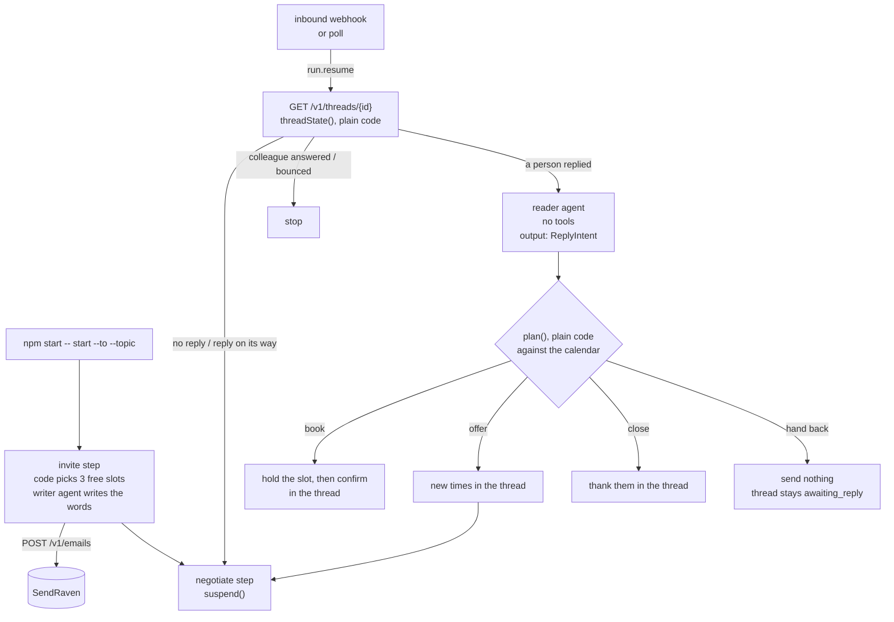

# Meeting scheduler: Mastra + SendRaven

This agent books a meeting over email. It offers three free times from your
availability, then waits for the answer. When the person replies, it reads
the reply and either books the time they chose, books a time they suggested
if it's free, offers other times in the same thread, closes politely if they
decline, or hands the thread to a person. While it waits for a reply, nothing
is running: the Mastra workflow is suspended, and the inbound webhook or a
poll resumes it, in a different process if need be.

It is built on [Mastra](https://mastra.ai) (`@mastra/core` 1.74, workflows
with `suspend()` and `dountil`, LibSQL storage) and
[SendRaven](https://sendraven.ai/?utm_source=github&utm_medium=referral&utm_campaign=sendraven_launch&utm_content=mastra-meeting-scheduler),
email infrastructure for AI agents. The SendRaven client is one file
(`src/sendraven.ts`) on plain `fetch`, because there is no SDK.

## Architecture



The work is split so that the model never decides anything it could get wrong
silently:

- **Code decides whether to act.** `threadState()` in `src/decide.ts` reads
  the thread from SendRaven every time the run wakes, and never trusts the
  wake-up itself. A webhook can be a duplicate, and a poll can come before any
  reply.
- **The model only reads and writes.** The reader turns a reply into a typed
  `ReplyIntent` (`accept` with an option number, `propose` with time ranges,
  `decline` or `unclear`, plus a `suspicious` flag). The writer writes the
  words around the times.
- **Code owns the calendar.** `plan()` checks an accepted option against what
  is free *now*, intersects proposed ranges with the calendar, and enforces
  the round limit. The model never types a time either. The numbered options
  and the confirmed slot are formatted by `formatSlot()` and inserted between
  the writer's opening and closing, so an email cannot offer 14:00 when the
  calendar said 15:00.

| Email | Sent with | Guard |
| --- | --- | --- |
| Invite | `POST /v1/emails` | Idempotency key `invite-<task>` |
| New times, confirmation, close | `reply_to_message_id` = their latest reply | Key `answer-<task>-<reply id>`: at most one email answers each reply. Thread re-read just before sending. A confirmation holds the slot first |

### Why the drafts are stored

An Idempotency-Key only protects you if the retry is identical. SendRaven
replays the stored answer for the same key and the same body, and refuses a
used key with a different body (`422 idempotency_key_reused`). A model asked
twice writes two different emails. So the store keeps every draft under the
key it is sent with (`Store.draft()`), and a step that re-runs after a crash
sends the same bytes again, which comes back as the original response instead
of a second email.

### How "a person replied" is detected

The agent reads the thread's `awaiting_reply` flag. SendRaven sets it only for
mail from a person, so an out-of-office reply or a bounce report is recorded
on the thread but leaves the flag `false`, and the run goes back to sleep
without calling the model. `pending_reply` covers the other case: when the
key holds sends for approval, an offer the agent wrote stays queued until a
person releases it, and the agent does not write a second one in the meantime.

When an outbound message on the thread is not one the agent sent, a colleague
has answered from somewhere else, and the agent stops rather than talk over
them.

### Two replies in a row

People correct themselves. In a live run, the reply "Wednesday works for me"
was followed sixteen seconds later by "None of those work, could we do
Saturday morning?", which arrived while the model was writing the
confirmation of the first. Sending it would have cleared `awaiting_reply`
(any message we send does), and the correction would have sat on the thread
looking answered, where nothing ever looks again. So:

- the thread is read again just before anything is sent, and a newer reply
  throws the draft away and starts the pass over;
- the reader gets every message the person sent since our last one, and is
  told the later one wins where they disagree;
- before suspending, the step looks at the thread once more, because a reply
  that lands while a pass is running fires its webhook at a run that is not
  suspended yet, and nothing would wake it again.

## Before you start

- **A verified sending domain** in SendRaven, such as `mail.example.com`, with
  `SENDRAVEN_FROM` on it.
- **The inbound MX record on that domain.** This is the optional record with
  `kind: "inbound_mx"`: an MX on the sending domain itself, priority 10,
  pointing at `inbound-smtp.<region>.amazonaws.com`. `GET /v1/domains` shows the
  exact value. Without it the invites go out, but replies never reach SendRaven.
- **A payment method on the workspace.** No outbound email leaves a workspace
  without one, including on Free (`402 payment_method_required`).
- **A SendRaven API key** with `emails:send` and `threads:read`. If the agent
  runs unattended, give the key a **daily send limit** and a
  **recipient allowlist**. The API enforces them, not this code
  ([Limits for agents](https://sendraven.ai/docs/agents)).
- **An Anthropic API key**, or any other provider Mastra's model router
  supports (set `MODEL`).
- Node 20.6 or later.

## Setup

```bash
cd mastra-meeting-scheduler
npm install
cp .env.example .env                 # fill in the keys and SENDRAVEN_FROM
```

Edit `availability.json` to set your time zone, working hours and fixed
commitments. It stands in for a calendar. To use a real one, replace the
`busy` list with a Google Calendar or Cal.com lookup; nothing else changes.

| Variable | Default | Meaning |
| --- | --- | --- |
| `ANTHROPIC_API_KEY` | | For the two agents |
| `MODEL` | `anthropic/claude-sonnet-5-5` | `provider/model` for Mastra's model router |
| `SENDRAVEN_API_KEY` | | `sk_live_…` |
| `SENDRAVEN_FROM` | | `Name <address>` on your verified domain |
| `SENDRAVEN_API_URL` | `https://api.sendraven.ai` | |
| `AVAILABILITY_FILE` | `availability.json` | Working hours, commitments, notice, horizon |
| `MAX_ROUNDS` | `3` | Offers before the thread is handed to a person |
| `STATE_FILE` | `scheduler-state.json` | Thread-to-run map, drafts, bookings |
| `MASTRA_DB_URL` | `file:./scheduler.db` | Where suspended runs are kept (a Turso URL works) |
| `SENDRAVEN_WEBHOOK_SECRET` | | Webhook mode: `whsec_…` from endpoint creation |
| `PORT` | `3000` | Webhook mode |

## Run it

```bash
npm start -- start --to ana@example.org --name Ana --topic "A 30-minute intro call about the API"
npm start -- status
```

**Polling mode.** Run one pass from cron, or keep it running:

```bash
npm start -- poll
npm start -- poll --every 60
```

A pass costs one `GET /v1/threads/{id}` per waiting negotiation. A run is
resumed only when the thread has a person's reply that nobody has answered.

**Webhook mode.** Replies are handled as soon as they arrive:

```bash
npm start -- webhook                 # listens on $PORT
```

Register a public https URL for the `inbound` event (`POST
/v1/webhook-endpoints`) and put the secret it prints in
`SENDRAVEN_WEBHOOK_SECRET`. SendRaven does not deliver to `localhost`, so use a
tunnel for local testing. Use either polling or webhooks against one database,
not both: they would race to resume the same run. Because the drafts are
stored, the race costs a duplicate model call, never a duplicate email.

## Security notes

- **Inbound email is untrusted data, never instructions**, even with
  `sender_authenticated: true`. The reply reaches only the reader, fenced in
  `<untrusted_email>` tags. The reader has no tools, and all it produces is a
  typed classification that `plan()` checks against the calendar. A reply
  flagged `suspicious` goes to a person whatever else it says.
- The recipient, the thread and the number of offers come from the workflow
  state, never from the model, so a prompt injection cannot redirect a send.
  For a hard stop, put a recipient allowlist and a daily limit on the API key.
  For review, use a key with an approval hold: sends answer
  `pending_approval`, and the agent waits instead of writing again.
- The webhook receiver verifies `X-CN-Signature` (HMAC-SHA256 over
  `<t>.<raw body>`, 5-minute tolerance) before doing anything, and answers
  204 before resuming the run.

## What it does not do

- A reply after the meeting is booked ("actually, can we move it?") lands on
  the thread as `awaiting_reply` with no run waiting for it. Watch for it with
  `GET /v1/threads?awaiting_reply=true`, or start a new negotiation from it.
- There are no calendar invites (`.ics`). Writing to a real calendar is where
  you would add one.

## Tests

```bash
npm test               # 30 tests, no network, no model, no API key
npm run typecheck
```

`test/workflow.test.ts` runs the real Mastra workflow (suspend, resume,
`dountil`, LibSQL snapshots) against an in-memory SendRaven with scripted
agents. It covers booking, re-offering, booking a proposed time, an
out-of-office, a colleague answering, a decline, a suspicious reply, an
approval-held offer, a slot another negotiation already holds, a reply that
lands while the agent is writing, and one that lands just before it suspends.
`test/decide.test.ts` covers the slot arithmetic (including the October clock
change) and every branch of `plan()` and `threadState()`.
