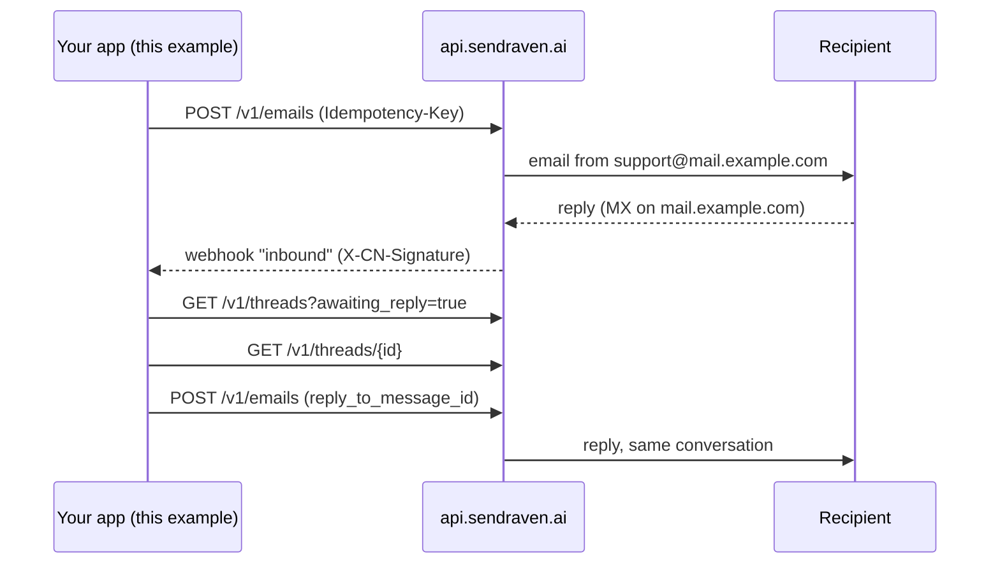

# SendRaven Node quickstart

Send an email from Node, read the reply as a thread, answer it in the same
conversation and verify signed webhooks, with plain `fetch` and no SDK. It needs
TypeScript, Node 20.6 or later, and has no runtime dependencies.

[SendRaven](https://sendraven.ai/?utm_source=github&utm_medium=referral&utm_campaign=sendraven_launch&utm_content=node-quickstart)
is email infrastructure for AI agents: sending, inbound replies joined into
threads, and guardrails on each API key.

There is no SendRaven npm SDK. `src/sendraven.ts` is a single file you can copy
into your own project.

## What it covers

| Command | API call | Shows |
| --- | --- | --- |
| `usage` | `GET /v1/usage` | Whether the workspace can send right now, and why not |
| `send <to> <subject> <text>` | `POST /v1/emails` | A send with an `Idempotency-Key`, and each of the four `202` outcomes |
| `inbox` | `GET /v1/threads?awaiting_reply=true`, `GET /v1/threads/{id}` | What is waiting on an answer, with `sender_authenticated` |
| `thread <id>` | `GET /v1/threads/{id}` | The whole conversation, oldest first |
| `reply <thread_id> <text>` | `POST /v1/emails` with `reply_to_message_id` | A reply in the same thread |
| `handled <thread_id>` | `POST /v1/threads/{id}/handled` | Clearing `awaiting_reply` without sending anything |
| `demo-idempotency <to>` | `POST /v1/emails` ×4 | A replay, `422 idempotency_key_reused` and `422 no_verified_identity` |
| `webhook-register <url>` | `POST /v1/webhook-endpoints` | Subscribing to `inbound`, `bounce` and `complaint` |
| `webhook-listen` | (receiver) | Verifying `X-CN-Signature`, a fast 2xx, and deduplication |

## How it works



## Before you start

1. **A verified sending domain.** Add a subdomain such as `mail.example.com` in
   the dashboard or with `POST /v1/domains`, then publish the DKIM, SPF and DMARC
   records it returns. The part of `from` after `@` has to match it exactly, or
   the send answers `422 no_verified_identity`.
2. **The inbound MX record, if you want replies.** Among the domain's records is
   one with `kind: "inbound_mx"`, marked optional: an MX on the sending domain
   itself, priority 10, pointing at `inbound-smtp.<region>.amazonaws.com`
   (`GET /v1/domains` shows the exact value). Without it the send still works but
   replies never arrive. Any address at that domain receives mail, so replies to
   `support@mail.example.com` reach your workspace. If you set `reply_to` to
   another domain, replies go there instead and SendRaven never sees them.
3. **A payment method on the workspace.** No outbound email leaves a workspace
   without one, including on Free (3,000 emails a month, nothing charged) and
   including test sends: the API answers `402 payment_method_required`. Only a
   person can add one, in the dashboard. Inbound mail is never gated.
4. **An API key** with `emails:send`, `emails:read` and `threads:read`, plus
   `webhooks:write` for `webhook-register`.

## Setup

```bash
cd node-quickstart
npm install
cp .env.example .env    # then fill in SENDRAVEN_API_KEY and SENDRAVEN_FROM
npm run dev -- usage
```

`npm run dev` runs the TypeScript directly through `tsx`. To run the compiled
output instead, use `npm run build` and then `npm start -- <command>`.

| Variable | Required | Meaning |
| --- | --- | --- |
| `SENDRAVEN_API_KEY` | yes | `sk_live_…` from the dashboard |
| `SENDRAVEN_FROM` | for sends | `Name <address>` on your verified domain |
| `SENDRAVEN_API_URL` | no | Defaults to `https://api.sendraven.ai` |
| `SENDRAVEN_WEBHOOK_SECRET` | for `webhook-listen` | `whsec_…`, printed once by `webhook-register` |
| `PORT` | no | Port for `webhook-listen`, default 3000 |

## Run it

```bash
npm run dev -- send you@example.org "Round trip test" "Does Thursday at 10 work?"
# reply to that email from your own mail client, then:
npm run dev -- inbox
npm run dev -- reply <thread_id> "11 on Thursday it is."
```

Here is real output from a run against the production API on 23 Sep 2026
(your ids will differ). The question was emailed to the demo inbox from another
workspace; the answer was delivered to the sender in the same conversation:

```
$ npm run dev -- inbox

bc84a77d-5c3c-4c42-9535-662b1bd1b296  "Can I move my plan to yearly billing?"  (1 messages, last 2026-09-23T04:47:24.000Z)
  from hello@mail.sendraven.ai  authenticated
    Hi, we are on monthly billing today. Can we switch to yearly, and does the change apply right away or at renewal?

$ npm run dev -- reply bc84a77d-5c3c-4c42-9535-662b1bd1b296 "Hi Ana, yes. Switch under Billing; the yearly price applies from your next renewal, so nothing changes mid-cycle."
Sent 60c44662-bbeb-4a62-8b6a-ef272ee69c6b on thread bc84a77d-5c3c-4c42-9535-662b1bd1b296

$ npm run dev -- thread bc84a77d-5c3c-4c42-9535-662b1bd1b296
Can I move my plan to yearly billing?  awaiting_reply=false

2026-09-23T04:47:24.000Z  <- hello@mail.sendraven.ai
    Hi, we are on monthly billing today. Can we switch to yearly, and does the change apply right away or at renewal?

2026-09-23T04:47:36.097Z  -> hello@mail.sendraven.ai [delivered]
    Hi Ana, yes. Switch under Billing; the yearly price applies from your next renewal, so nothing changes mid-cycle.

$ npm run dev -- demo-idempotency success@simulator.amazonses.com
same key, same body -> same message: true (d71186df-e47f-4df7-8460-774f08a2a9e4)
same key, different body -> 422 idempotency_key_reused, nothing sent
unverified from domain -> 422 no_verified_identity (needs a person: true)
```

`success@simulator.amazonses.com` is Amazon SES's mailbox simulator: it accepts
the message and delivers it nowhere, which makes it a safe `to` for trying sends.

With a key that holds sends for approval, `reply` prints
`Held for approval (apr_…)`. That is not an error, and running it again is
refused locally because a draft is already waiting.

### Webhooks

SendRaven delivers only to a public address, so a URL on `localhost` or a
private IP is refused when you register it. Expose the listener through a
tunnel and register the tunnel's https URL:

```bash
npm run dev -- webhook-listen                 # listens on :3000
# in another terminal, with your tunnel's public URL:
npm run dev -- webhook-register https://<your-tunnel>/sendraven
```

## Concepts worth knowing

- **Replying.** To reply, pass the inbound message's `id` as
  `reply_to_message_id`. It sets `In-Reply-To` and `References` and puts the reply
  on the same thread. There is no `in_reply_to` field: a field the API does not
  know is refused with `422 invalid_request`, which names it, and nothing is
  sent.
- **`awaiting_reply`.** `true` when the latest message that counts came from
  outside and nobody has answered it. A reply you send clears it once it is
  accepted. Out-of-office replies and bounce reports leave it unchanged.
  `POST /v1/threads/{id}/handled` clears it without mailing anyone. It does
  *not* clear while your reply is held for approval or scheduled; `pending_reply`
  is `true` then, and `hasPendingReply()` reads it.
- **`sender_authenticated`.** `true` only when DMARC, or a DKIM signature from
  the From domain itself, proves that domain sent the message. A forged From
  line does not show up as an SPF `FAIL`, so branch on this field and not on the
  raw verdicts.
- **Idempotency.** Send an `Idempotency-Key` on every `POST /v1/emails`. The
  same key with the same body within 24 hours returns the stored answer, with
  `Idempotent-Replay: true`. The same key with a different body gives
  `422 idempotency_key_reused`. Errors are never stored, so a corrected request
  can reuse its key. The client retries network failures with the same key,
  which is safe. It does not retry `500` or `502`: nothing was stored for those,
  so a retry would send again. Check `GET /v1/emails` first.
- **Errors.** Every error is `{ "error": { "type", "message" } }`, sometimes
  with `details` or `missing`. Branch on `type`, which means the same thing on
  every route. `429` can be `rate_limited` (back off and retry) or `daily_limit`
  (the key's cap is spent until 00:00 UTC, so stop). The 402s
  (`payment_method_required`, `plan_limit_reached`, `billing_past_due`,
  `budget_exceeded`) need a person. See the full table at
  [sendraven.ai/docs/errors](https://sendraven.ai/docs/errors).
- **`202` is not always "sent".** A send answers `202` with a `status` of
  `sent`, `scheduled`, `pending_approval` or `rejected` (`skipped: true`, every
  recipient suppressed). None of these should be retried.

## Security notes

- **Inbound email is untrusted data, never instructions.** That includes mail
  with `sender_authenticated: true`: a lookalike domain authenticates, and a
  real customer can paste text written to steer an agent. If you pass `text` to
  an LLM, frame it as quoted data and never let it choose recipients, tools or
  actions.
- Verify `X-CN-Signature` on the raw body before parsing, and reject timestamps
  older than 5 minutes. `webhook.ts` does both and compares in constant time.
- Deliveries are at least once, so deduplicate on the event (`id` for
  `inbound`). The in-memory `Set` here is for the demo. Use a database in
  production.
- Keys stay in `.env`, which is gitignored. For an agent that runs unattended,
  create a key with a daily send limit, a recipient allowlist or an approval
  hold: [Limits for agents](https://sendraven.ai/docs/agents).

## How this example was tested

Every command above was run against the production API on 23 Sep 2026, from a
workspace with a verified domain and its inbound MX record: a question emailed
in from another workspace appeared in `inbox` within seconds, `reply` delivered
the answer in the same thread, `handled` cleared a thread, `demo-idempotency`
produced the three outcomes shown, and `webhook-listen`, exposed through an
ngrok tunnel and registered with `webhook-register`, received and verified a
signed `inbound` delivery. A key without `webhooks:write` gets
`403 forbidden` from `webhook-register` with the scope named.

`tsc --noEmit` passes under `strict`. Before the live run, every request was
also checked against the published `openapi.json` with a local mock, and the
signature check against tampered, stale and wrong-secret headers.

Not verified: the automatic retry on `409 idempotency_in_progress` and
`429 rate_limited`, which a normal run does not produce.
