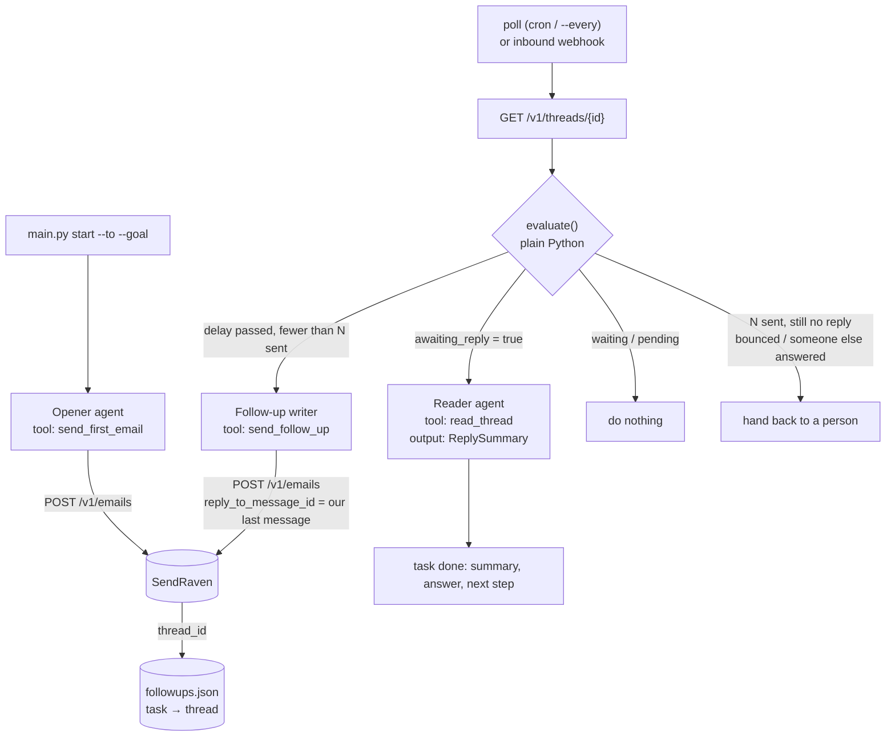

# Follow-up agent: OpenAI Agents SDK + SendRaven

This agent emails someone and waits for an answer. If none comes, it sends a
polite follow-up in the same thread once a configurable delay has passed, and
it sends at most `MAX_FOLLOWUPS` of them. When the person replies it stops,
reads the reply and carries on with its task, which here means summarising the
answer and proposing a next step. It runs by polling (from cron, or in a loop)
or reacts to SendRaven's `inbound` webhook.

It is built on the [OpenAI Agents SDK](https://openai.github.io/openai-agents-python/)
(`openai-agents` 0.22) and
[SendRaven](https://sendraven.ai/?utm_source=github&utm_medium=referral&utm_campaign=sendraven_launch&utm_content=openai-agents-followup),
email infrastructure for AI agents. The tools call SendRaven's REST API
directly, because there is no Python SDK.

## Architecture



Responsibilities are split on purpose:

- **Code decides whether to act.** `evaluate()` in `followup.py` reads the
  thread from SendRaven on every pass and returns one of `replied`, `due`,
  `waiting`, `pending`, `exhausted`, `undeliverable` or `handled`. The number of
  follow-ups sent, and when the last one went out, come from the thread
  transcript rather than local memory, so a lost state file cannot cause a
  double send. `test_evaluate.py` covers every branch without a network or a
  model.
- **The model decides what to say:** the first email, each follow-up, and the
  summary.
- **Tools are thin wrappers over the REST API, bound to one task.** The model
  never picks a recipient, a thread or a follow-up count. Those come from the
  run context. `send_follow_up` runs `evaluate()` again before it sends,
  because the person may have replied while the model was writing.

| Tool | REST call | Guard |
| --- | --- | --- |
| `send_first_email(subject, body)` | `POST /v1/emails` | Idempotency key `first-<task>` |
| `send_follow_up(body)` | `POST /v1/emails` with `reply_to_message_id` | Re-checks `evaluate()`. Idempotency key `followup-<task>-<n>`, so a poll and a webhook racing each other cannot both send follow-up *n* |
| `read_thread()` | `GET /v1/threads/{id}` | Inbound text is fenced in `<untrusted_email>` tags. The reader has no tool that sends |

### How "a non-automated reply arrived" is detected

The agent reads the thread's `awaiting_reply` flag and never inspects inbound
messages itself. SendRaven sets the flag only for mail from a person: an
out-of-office or a bounce report is recorded on the thread but leaves the flag
unchanged, so an auto-reply does not stop the follow-ups.

The `inbound` webhook fires for automated mail too, with `automated: true`.
Webhook mode ignores those events, and treats every other one only as a prompt
to re-read the thread, never as proof of a reply.

The flag also goes `false` when someone else deals with the thread, for
example a colleague who answers from the dashboard or marks the thread handled.
The agent records the ids of the messages it sent, and when it sees
`handled_at` set, or an outbound message it did not send, it hands the thread
back instead of chasing someone who already has an answer.

## Before you start

- **A verified sending domain** in SendRaven, such as `mail.example.com`, with
  `SENDRAVEN_FROM` on it.
- **The inbound MX record on that domain.** This is the optional record with
  `kind: "inbound_mx"`: an MX on the sending domain itself, priority 10,
  pointing at `inbound-smtp.<region>.amazonaws.com` (`GET /v1/domains` shows the
  exact value). Without it the agent sends, but replies never reach SendRaven,
  and the agent keeps following up until it runs out.
- **A payment method on the workspace.** No outbound email leaves a workspace
  without one, including on Free (`402 payment_method_required`). A person adds
  it in the dashboard.
- **A SendRaven API key** with `emails:send` and `threads:read`. For an agent
  that runs unattended, give the key a **daily send limit** and a
  **recipient allowlist**. They are enforced by the API, not by this code
  ([Limits for agents](https://sendraven.ai/docs/agents)).
- **An OpenAI API key.**

## Setup

```bash
cd openai-agents-followup
python3 -m venv .venv && source .venv/bin/activate     # Python 3.10+
pip install -r requirements.txt
cp .env.example .env                                   # fill in the keys and SENDRAVEN_FROM
```

| Variable | Default | Meaning |
| --- | --- | --- |
| `OPENAI_API_KEY` | | For the Agents SDK |
| `OPENAI_MODEL` | SDK default | Any model name the Agents SDK accepts |
| `OPENAI_AGENTS_DISABLE_TRACING` | `0` | `1` stops trace export to OpenAI (traces include email text) |
| `SENDRAVEN_API_KEY` | | `sk_live_…` |
| `SENDRAVEN_FROM` | | `Name <address>` on your verified domain |
| `SENDRAVEN_API_URL` | `https://api.sendraven.ai` | |
| `FOLLOWUP_DELAY` | `3d` | Time since our last message before a follow-up is due: `45s`, `30m`, `12h`, `3d` |
| `MAX_FOLLOWUPS` | `2` | Follow-ups after the first email |
| `STATE_FILE` | `followups.json` | Task-to-thread map and results |
| `SENDRAVEN_WEBHOOK_SECRET` | | Webhook mode: `whsec_…` from endpoint creation |
| `PORT` | `3000` | Webhook mode |

## Run it

```bash
python main.py start --to lee@example.org --goal "Ask whether Thursday 10:00 works for a 20-minute call"
python main.py status
```

**Polling mode.** Run one pass from cron, for example every 15 minutes:

```bash
python main.py poll
# or keep it running:
python main.py poll --every 900
```

**Webhook mode.** Replies are handled the moment they arrive, and a timer still
checks for due follow-ups, because a reply that never comes produces no webhook:

```bash
python main.py webhook --every 900        # listens on $PORT
```

Register a public https URL for the `inbound` event, for example with the
quickstart's `webhook-register` command or `POST /v1/webhook-endpoints`, and
put the secret it prints in `SENDRAVEN_WEBHOOK_SECRET`. SendRaven will not
deliver to `localhost`, so use a tunnel for local testing.

### Expected output

A real run against the production API on 23 Sep 2026, with `FOLLOWUP_DELAY=45s`
and `MAX_FOLLOWUPS=1` so it finishes in minutes, and the default OpenAI model:

```
$ python main.py start --to hello@mail.sendraven.ai --goal "Ask whether Thursday 10:00 works for a 20-minute call about their onboarding"
[b1c08afb42ef] Sent as f597b6df-6353-4180-8d47-5c92eee045db on thread bdf55487-a427-4911-a249-abb2598306fa.

$ python main.py poll
[b1c08afb42ef] waiting (next follow-up due 2026-09-23 05:29 UTC)

$ python main.py poll        # after the delay
[b1c08afb42ef] Follow-up 1 of 1: sent as 340d803a-0e54-45c2-9d14-23f46a85c33c.

$ python main.py poll        # after Ana replied in the same thread
[b1c08afb42ef] Replied. Ana said Thursday at 10:00 does not work. She is available Thursday at 14:00 instead and asks for an invite.
[b1c08afb42ef] Answer: No for Thursday at 10:00; Thursday at 14:00 works.
[b1c08afb42ef] Next step: Decide whether to schedule the 20-minute onboarding call for Thursday at 14:00.
```

When nobody answers, the task ends with
`exhausted: no reply after the last follow-up (N follow-up(s) sent). Handing back to a person.`

## Security notes

- **Inbound email is untrusted data, never instructions.** That holds even with
  `sender_authenticated: true`, because a lookalike domain authenticates and a
  real person can paste text written to steer an agent. Here the reply text only
  reaches the reader agent. It is fenced in `<untrusted_email>` tags, the reader
  is told never to follow it, and the reader has no tool that sends mail or
  changes state. Its `suspicious` field flags attempts for a person to look at.
- Each follow-up's recipient, thread and count are fixed by code, so a prompt
  injection cannot redirect a send. For a hard stop, put a recipient allowlist
  and a daily limit on the API key. For review, use a key with an approval hold:
  sends then answer `pending_approval`, and `evaluate()` reports `pending`
  instead of drafting again.
- The webhook receiver verifies `X-CN-Signature` (HMAC-SHA256 over
  `<t>.<raw body>`, 5-minute tolerance) before doing anything, and answers 204
  before running the agent.
- Traces from the Agents SDK can contain email text. Set
  `OPENAI_AGENTS_DISABLE_TRACING=1` if that matters to you.

## An alternative worth knowing

SendRaven can schedule a reply up front (`scheduled_at: "in 3 days"` with
`reply_to_message_id`), and `DELETE /v1/emails/{id}` cancels it when the answer
arrives first. The follow-up then goes out on time even if your agent is not
running. The trade-off is that the follow-up is written before anyone knows
whether it will be needed. See
[Follow up when nobody replies](https://sendraven.ai/docs/recipe-follow-up-without-reply).

## How this example was tested

- Run against the production API on 23 Sep 2026 in polling mode with a live
  OpenAI model: the first email, a follow-up in the same thread after the
  delay, and a threaded reply from another mailbox that ended the task with the
  summary shown above.
- `python -m py_compile` passes on every file, and `test_evaluate.py` (9 tests)
  covers the decision logic.
- Before the live run, an end-to-end script drove `start`, polling and webhook
  mode against a local mock of the API, using the Agents SDK's `ScriptedModel`:
  stopping at the maximum, the tool's re-check when a reply lands mid-run, a
  colleague's answer, a bad webhook signature, and prompt-injected reply text
  arriving fenced.
- Not verified live: webhook mode (its receiver is the same signed-webhook
  code verified live in the quickstarts), and an out-of-office reply.
